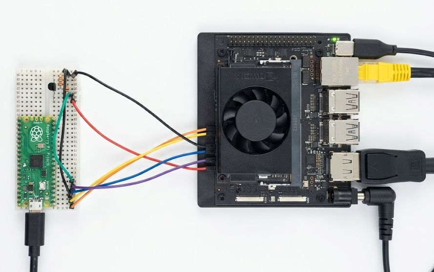

# Wiring

J14 button header on the Jetson Orin Nano Devkit (carrier spec SP-11324-001,
Table 3-4). The same carrier takes Orin NX modules, so the wiring is identical.
The RP2040 is 3.3 V; UART2 and the two open-drain button lines (SYS_RESET*,
FORCE_RECOVERY*) sit at 1.8 V, and SLEEP/WAKE* is 5 V, so that one goes through a
transistor. Don't drive a J14 pad from 5 V directly. The silkscreen is tiny, so
count pins from the keyed end before you power anything.



## Pins

| RP2040 | J14 pin | Signal          | Level | Drive |
| ------ | ------- | --------------- | ----- | ----- |
| GP0    | J14.3   | UART2_RXD       | 3.3 V | Serial1 TX |
| GP1    | J14.4   | UART2_TXD       | 3.3 V | Serial1 RX |
| GP2    | J14.8   | SYS_RESET*      | 1.8 V | open-drain, assert = LOW |
| GP3    | J14.10  | FORCE_RECOVERY* | 1.8 V | open-drain, assert = LOW |
| GP4    | via Q1  | SLEEP/WAKE*     | 5 V   | NPN, HIGH = pressed |
| GND    | J14.7   | GND             | -     | common (7/9/11 all GND) |

GP0-GP3 are direct wires. The two open-drain lines assert by driving the pin LOW
(OUTPUT) and release by going back to INPUT (hi-Z); the carrier already pulls them
up. GP4 can't touch the 5 V SLEEP/WAKE* line, so it switches a small NPN instead
(BC547B in my case, anything similar is fine):

```
                +5V
                 |
              J14.12
                 |
                (C)
                 |
 GP4---[1k]-----(B)
            |    |
          [10k] (E)
            |    |
           GND  GND
```

GP4 HIGH saturates the transistor and pulls SLEEP/WAKE* to ground (button
pressed); GP4 LOW lets the carrier pull it back up.

## Press timing

The on-module supervisor (power.c) treats a 10 s hold as force-off and a short
press as on/wake, so the host drives SLEEP/WAKE* for 100 ms to power on, 10.5 s to
force off, and off-then-on for a cycle. The Nano 33 BLE works too, best-effort and
untested: it wants the Adafruit UF2 bootloader and the GPIO levels line up.
